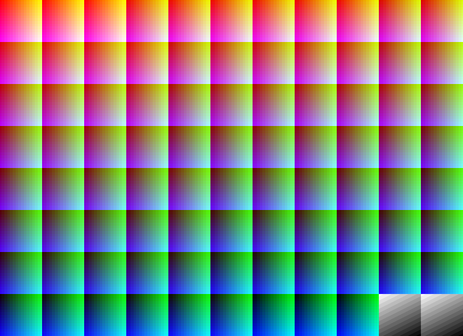
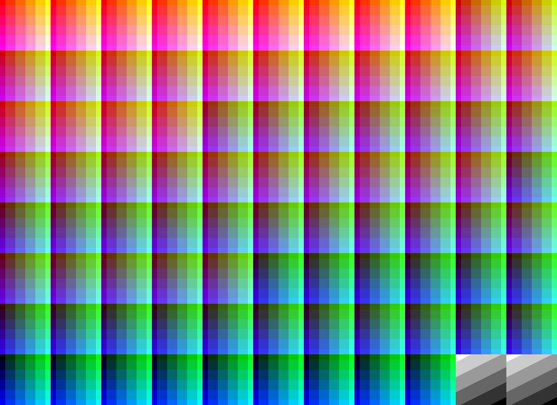
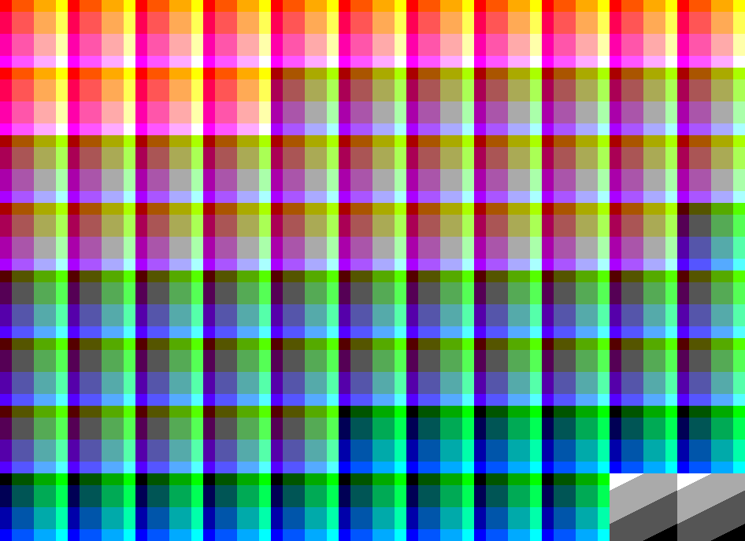
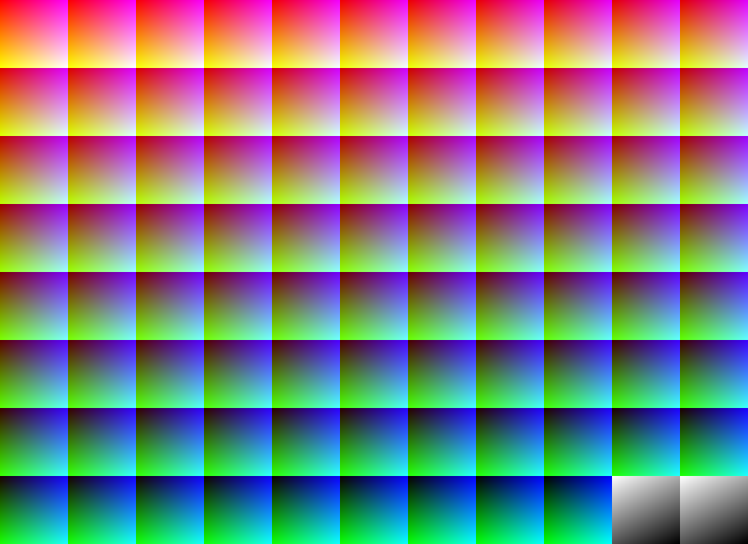
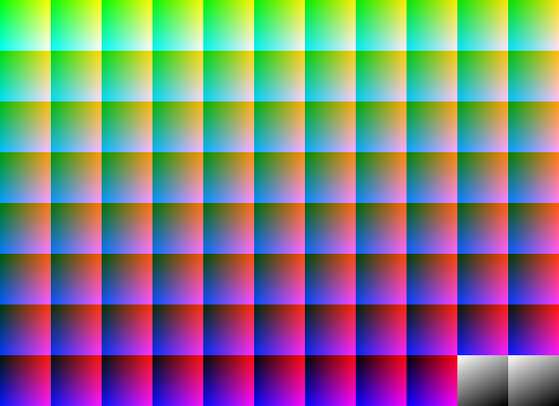
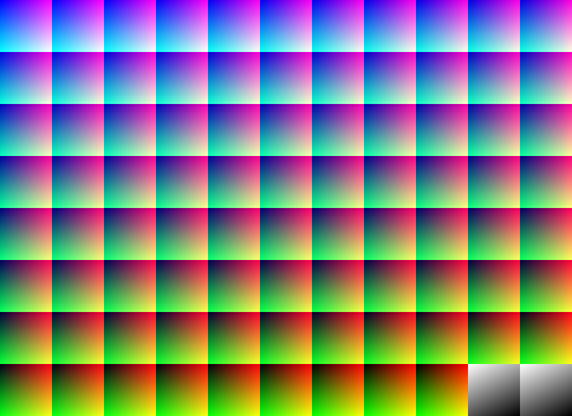
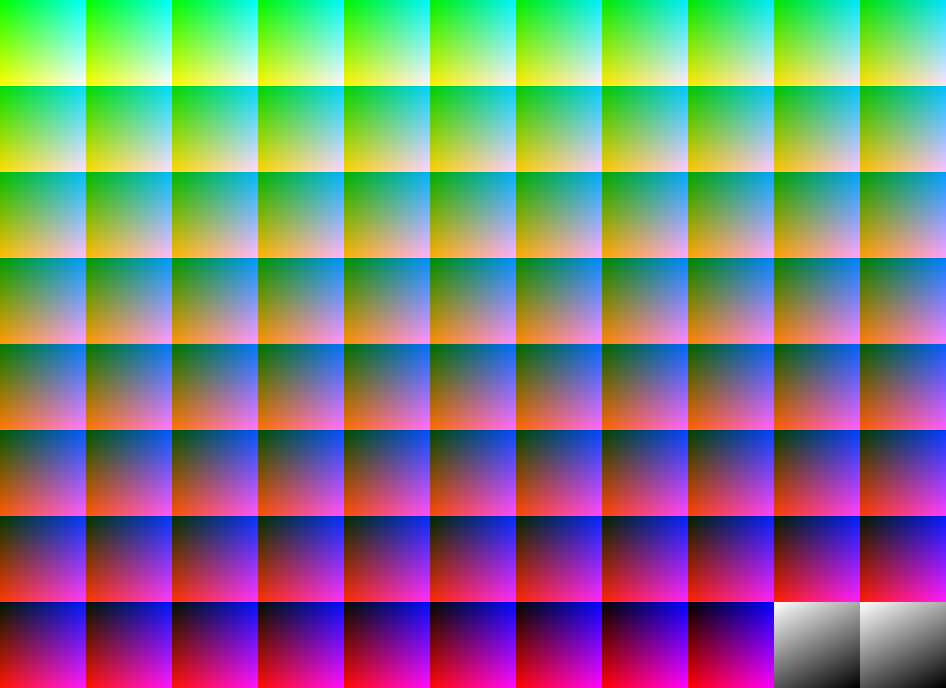
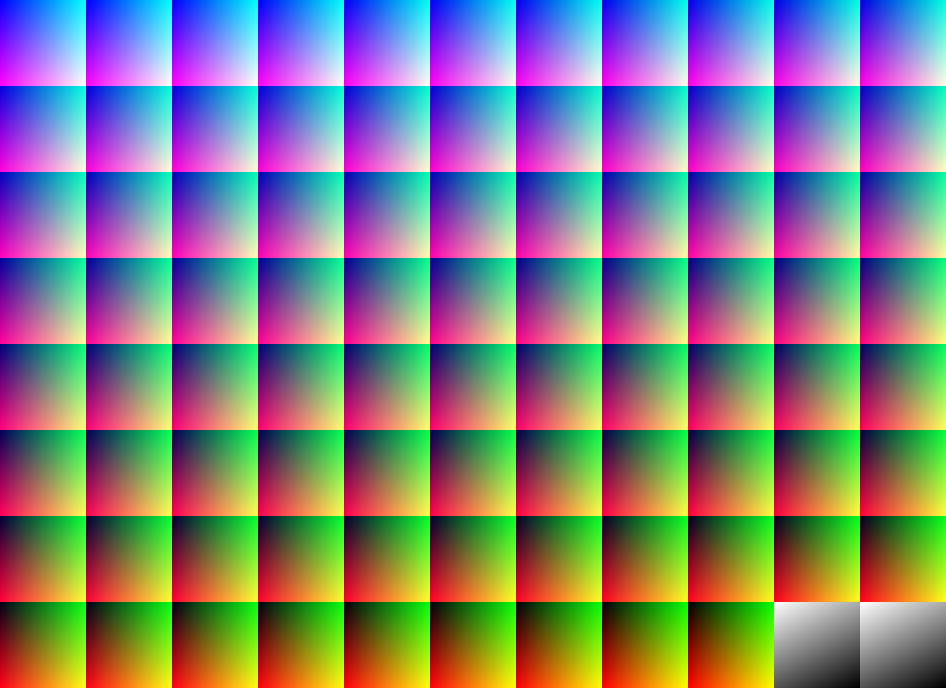

# pixel8r Manual

## General Tips/Cautions

This program contains multiple options for image manipulation. Presently, most operations that change the color of the image do so on a pixel-by-pixel basis. This means some methods can be a bit slow. Additionally, operations on predefined palettes compare on each color, so these take more time the larger the palette is.

If any crop is intended, it's recommended as the first step, in order to reduce the number of pixels needed in computation. This can also be true of resizing down, but keep in mind that a resize involves a loss in pixel fidelity by nature, so the order of resize/recolor steps is not idempotent. In other words, resizing and then changing palette won't always be 100% the same as changing the palette and then resizing.

There are no failsafes against multiple operations that may not make sense together. For example, if you change the colors to a discrete palette, the image won't be "locked" to this palette. So if you then choose to tint it or saturate, the new colors won't actually be members of the palette anymore.

pixel8r does not overwrite the original loaded image, so it is safe to mess around with as much as desired.

## Example Image

The example image in this document was generated to approximate the entire RGB color space. Since RGB is based on three values from 0-255, it would take 256^3 = 16,777,216 pixels to display every possible color at minimum - that's about two complete 4K monitors! 

Instead, it goes every 3 values, for a more manageable 86^3 - 636,056 pixels (although the actual image is a bit larger since 86 squares don't easily make for a uniform rectangle):

## Basic Controls

The menu strip on the top left has controls to open or save a file, undo and relod.

- Open File currently supports .png, .jpg, .bmp and .gif file formats.
- Save File supports the same formats.
- Undo currently supports only going back one step.
- Reload will reset the image for the currently loaded file.

## Changing to a Predefined Palette

The first dropdown consists of palettes with a discrete set of colors. Upon selecting one, the Palette Preview pane will show squares of all the available colors in the selected palette. Once an algorithm is selected, the button to make the swap becomes available. Upon clicking this button, it will attempt to update each pixel's color to the closest available one in the palette according to the chosen algorithm.

### Algorithm Details

Color matching is based on the idea of a mathematical measure of the smallest "distance" between colors. More details can be found on this [Wiki Page](https://en.wikipedia.org/wiki/Color_difference). 

With the example image, we can see the differences in how different algorithms produce matches to an NES color palette:

  
  
  
  
  
  
  
  
  
  
  
  
  

## Changing to a Programmatic Palette

Programmatic palettes change the palette based on some kind of formula instead of a discretely defined set.

#### Saturation

Saturation is, in plain terms, roughly a measure of the "boldness" a color. On a scale of 0.0 to 1.0, or 0 to 100%, each application of the Saturate option increases it by +5%. Therefore, after at most 20 applications this won't change the image anymore. The benefit of saturation is that by making the colors "pop" a bit more, it tends to match better on a palette of simple colors. For example, on an unaltered photo it can have difficulty with skin tones or the subtle gray elements of a blue sky.

The effect isn't super noticeable on the example image, so here is a lone example with the saturation at max. The affect on the grayscale squares shows a potential downside with too much saturation - the HSL/HSV model produces black/white/gray by saturation and lightness/value only, with red being the default 0 hue value.

#### RGB Multiples of X

All of the palettes in this category are based on factors of 255. The idea with these is if we can approximate the original color space with a smaller, simpler palette, maybe when subsequently changing to a discrete palette, there will be a better chance of matching. For each factor, 255 divided by the factor value produces the number of steps to count to 255. Add one to that to account for 0 and you get the number of values for each of R, G, B. That number cubed is the total number of available colors:

Factor | Values | Total Colors |
| --- | --- | --- |
3 | 86 | 636,056 |
5 | 52 | 140,608 |
15 | 18 | 5832 |
17 | 16 | 4096 |
51 | 6 | 216 |
85 | 4 | 64 |

Some examples that don't show a big difference are skipped, but here are some noticeable ones:

  
  
  

#### Transpose

These algorithms are more "just for fun" since the resultant colors don't really have any significance. These swap the bytes for each of R, G and B around. So for example, in the BRG one, the red comes from the original blue value; green comes from the original red value; and blue comes from the original red value.

  
  
  
  
  

## Tinting

Tinting works more or less the same way as a programmatic palette, although it's more focused on accentuating a certain color. The colors that can be accentuated are:

- Primary: Red, Green, Blue
- Secondary: Cyan, Magenta, Yellow
- Black, White, Grayscale

The differences between what I've called "hard" and "soft" tinting, as well as the "scales" are explained below. There is no hard or soft tint for black and white since those colors use all bytes in the RGB space.

#### Soft Tint

Adds a small increment to only the color byte(s) that contribute to the selected tint. So for example, if you are tinting Magenta, the R and B bytes will gradually increase, with G staying the same. Can be done multiple times to intensify.

#### Hard Tint

Adds increments to the tint byte(s) just like a soft tint, but _also_ decrements the byte that doesn't contribute. So following the example from before, since the G byte will decrease, if this tint was applied repeatedly, eventually it would produce a screen of pure Magenta.

#### Scale

Gets an average value of the existing color bytes, then multiplies them by weighted values to make the desired tint color. In practice, this makes the tint much more intense than the other methods. The weight values were chosen based on experimentation. They differ because of perceptual differences in color, i.e. red tends to appear brighter than blue, so blue is weighted softer so as to avoid an overly dark appearance.

## Crop

Crop values are preselected based on common aspect ratios, including pixel perfect ratios of certain consoles. When clicking the Preview button, hovering over the picture produces a preview rectangle. Clicking on the picture when the rectangle is fully within the picture bounds will crop.

## Resize

TBD - Operation not working how I want it currently

## Pixelate

TBD - Operation not working how I want it currently

## Dither

TBD - Operation not working how I want it currently