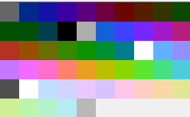
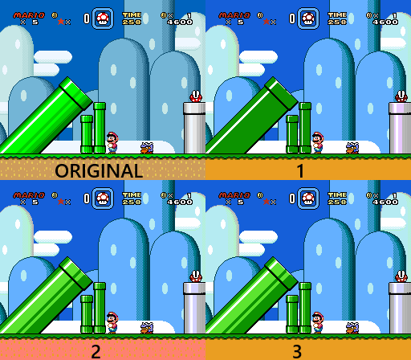

# Results

WIP - Not sure on final name. Doc for explaining some of process/logic behind program

## Palette Swapping Algorithms

A key element of creating the image is replicating palette limitations. My approach to this involves a pixel-by-pixel replacement. For each pixel, the program scans through the available colors in the palette and tries to determine the closest one to the current pixel. This part turned out to be trickier than it sounds, and involved a lot of experimentation with different algorithms to attempt to match a color.

### Euclidean RGB

In this section, I'll label screenshots with 1, 2 and 3 for each method, which are described here. I came up with the first method on my own, but then ended up looking a few up when I wasn't satisfied with it. The second two come from this section of a wiki page: https://en.wikipedia.org/wiki/Color_difference#sRGB

Method 1: Simply takes the difference between each of red, green, and blue values for two colors, and sums these together. The color in the palette with the smallest difference is chosen to replace the color.

Method 2: Similar to method 1, but each difference is squared before they are all summed. 

Method 3: Uses the "redmean" detailed on the wiki page, which attempts to weigh the colors differently.

  
  
  
  

It turns out, at least for this example, my original algorithm wasn't that far off from what the improved versions provide. The differences are subtle, but you can see them if you look closely - some purple in the sky for method 1, the neck changes, the decrease in that salmon color on the face.

But that was also a disappointment, as these clearly look not nearly good enough. It struggles with the blue sky and the peachy flesh tones. It's not as if the palette used lacks colors you would think are closer:

It's worth noting that some examples proved more diverse. Here is a screenshot from a SNES game, replicated with NES colors:

Here we can see that there isn't one definitive standout, although 1 is clearly the worst with its dark pipes that lack shine. The only difference I can eyeball between 2 and 3 is in the dirt at the very bottom. I'd say 3 has a closer color, but if you look closely, 2 retains more textural color variation, so I'd call it even.

